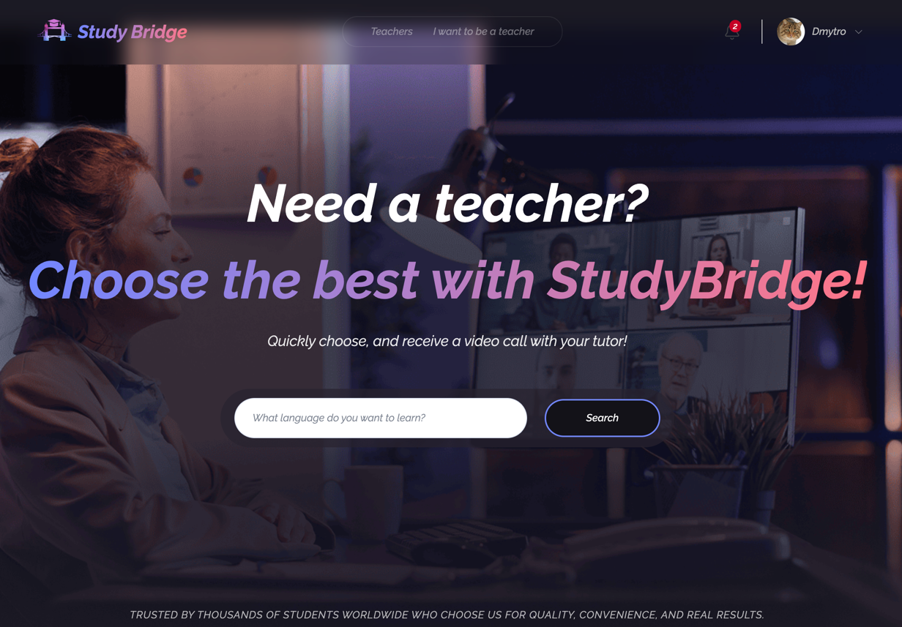
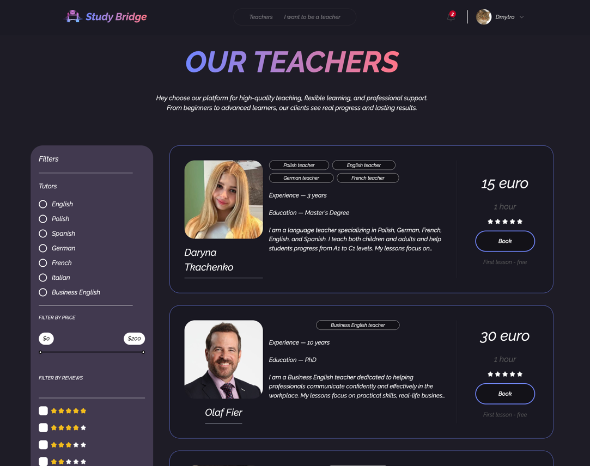
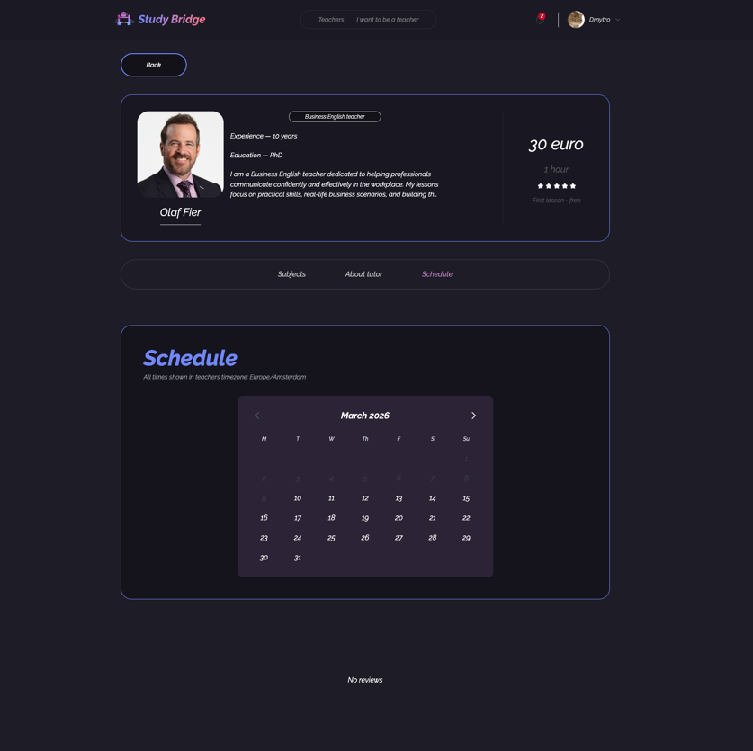
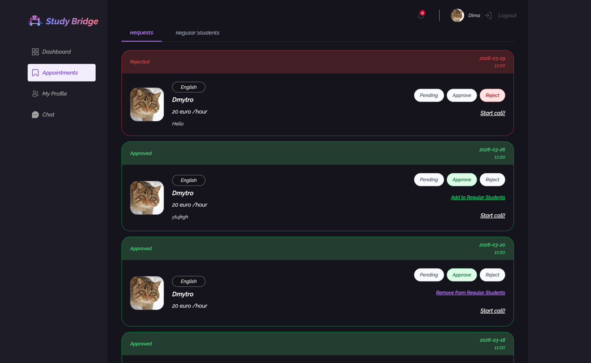

# StudyBridge

## Overview

StudyBridge is a full-stack educational platform that connects students and teachers in one ecosystem.  
The application is designed to simplify the process of finding a tutor, booking lessons, managing communication, and organizing the learning workflow in real time.

The platform supports two main user journeys:

- **Student flow** - search for teachers, view profiles, create lesson appointments, communicate with tutors, receive notifications, and join online lessons
- **Teacher flow** - create and manage a professional profile, receive and process appointment requests, communicate with students, manage regular learners, and conduct online lessons

In addition, the platform includes moderation flows that help keep content structured and the teacher approval process controlled.

StudyBridge is built as a modern full-stack application with strong attention to architecture, scalability, and real user interaction. The project combines a React-based client application with a Node.js backend,
real-time features via WebSockets, structured backend layering with CQRS, dependency injection, and TypeScript across the stack.

---

## Tech Stack

### Core stack
- **MERN**
- **TypeScript**
- **CQRS**
- **Dependency Injection**

### Frontend
- **React**
- **React Router**
- **TanStack Query (React Query)**
- **Zustand**
- **Socket.IO Client**
- **Tailwind CSS**
- **Framer Motion**
- **Axios**

### Backend
- **Node.js**
- **Express**
- **Socket.IO**
- **MongoDB**
- **Mongoose**
- **InversifyJS**

### Tooling
- **ESLint**
- **Prettier**
- **Husky**
- **npm**

---

## Full Stack Description

### MERN
StudyBridge follows the **MERN** stack architecture:

- **MongoDB** for storing users, appointments, conversations, messages, notifications, and related entities
- **Express** for building the backend API and request handling
- **React** for the client-side user interface
- **Node.js** as the server runtime

### TypeScript
TypeScript is used across both frontend and backend to ensure strong typing, safer refactoring, and better maintainability. This helps reduce runtime errors and improves developer experience.

### CQRS
The backend uses **CQRS (Command Query Responsibility Segregation)**:

- **Command repositories** are responsible for create, update, and delete operations
- **Query repositories** are responsible for read operations

This separation makes the backend more scalable and keeps business logic organized.

### Dependency Injection
The backend uses **InversifyJS** for dependency injection.  
This allows services, repositories, and controllers to stay decoupled and easier to test.

### Real-time communication
**Socket.IO** powers the real-time features of the platform:

- live chat messaging
- typing indicators
- unread message counters
- online presence tracking
- incoming call events
- live notifications

### State management
The frontend clearly separates responsibilities between:

- **React Query** for server state
- **Zustand** for client-side and UI state

This keeps the application predictable and easier to manage as it grows.

---

## Features

### Authentication and authorization
- Student and teacher registration
- Secure login flow
- Access token and refresh token handling
- Protected routes
- Role-based access control
- Session restore and logout flow

### Teacher discovery
- Browse teacher profiles
- View lesson details, pricing, and profile information
- Search and filtering
- Teacher profile editing

### Appointment management
- Create lesson appointments
- Approve or reject lesson requests
- Track appointment statuses
- Manage regular students
- Support recurring weekly schedules

### Real-time chat
- One chat per teacher-student pair
- Real-time messaging
- Typing indicators
- Online presence
- Unread message counters
- Read/unread synchronization

### Notifications
- Real-time notifications for new messages
- Notifications for appointment approval or rejection
- Persistent notifications stored in database
- Mark one as read
- Clear read notifications

### Video calls
- Online lesson calls
- Incoming call popup
- Join links for specific calls
- Teacher-student live communication flow

### Moderation
- Teacher moderation workflow
- Status management
- Restricted moderator routes

---

## Screenshots

### Home page


### Teachers list


### Teacher profile


### Appointments


---

## Architecture

StudyBridge is structured as a layered full-stack application.

### Frontend architecture
The frontend is built as a React SPA with a modular structure.

Main responsibilities are split into:
- **Pages** for route-level UI
- **Components** for reusable UI blocks
- **Features** for domain-specific logic
- **Hooks** for reusable behavior
- **Stores** for client-side state
- **API layer** for backend communication

### Backend architecture
The backend is divided into clear layers:

- **Controllers** — handle HTTP requests and responses
- **Services** — contain business logic
- **Command repositories** — handle write operations
- **Query repositories** — handle read operations
- **Schemas/models** — define persistence layer
- **Socket handlers** — manage real-time events

This structure helps keep the codebase maintainable and scalable.

---

## Why this project is technically interesting

StudyBridge is more than a simple CRUD application.  
It combines several real-world product requirements in one system:

- authentication with refresh flow
- role-based access control
- real-time messaging
- persistent notifications
- appointment approval workflow
- online presence tracking
- video call integration
- CQRS-based backend architecture
- dependency injection

The project demonstrates how to build a production-style platform with real-time communication and maintainable architecture.

---

## Project Goal

The goal of StudyBridge is to provide a convenient and structured environment where:

- students can quickly find suitable teachers
- teachers can present their expertise and manage their work
- both sides can communicate smoothly in one application

The platform is designed to reduce friction in online learning by combining search, booking, messaging, and lesson management in a single place.

---

## Folder Structure

### Client
```bash
client/
    src/
        api/
        components/
        features/
        hooks/
        layouts/
        pages/
        router/
        store/
        types/
        util/
    
server/
    src/
        composition/
        controllers/
        db/
        repositories/
        commandRepositories/
        queryRepositories/
        routes/
        services/
        socket/
        types/
        utils/
        validation/
```
## How to run locally

## Clone repository
```bash
git clone <your-repository-url>
cd StudyBridge
```

## Install dependencies
```bash
npm install
cd client && npm install
cd ../server && npm install
```
## Start the development servers

```bash
cd client
npm run dev
```
##  Open the application
```bash
http://localhost:5173
```


